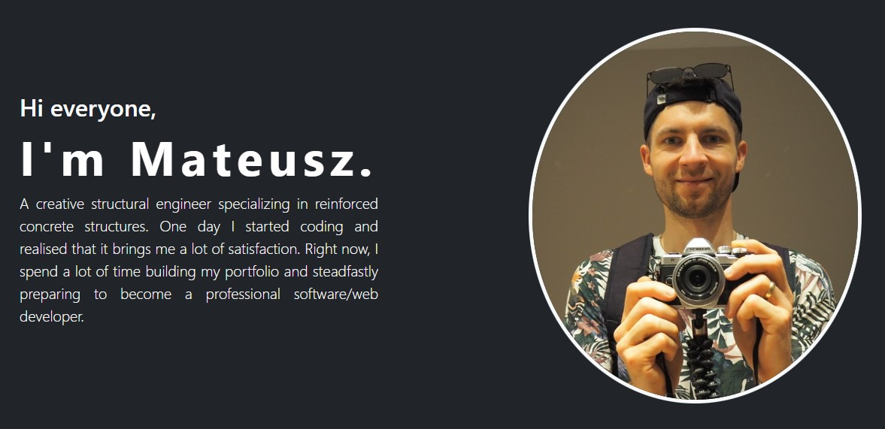

# Web Development Bootcamp - Capstone-Project-2_Personal-Site

Final Project of CSS course using Bootstrap - Personal website Mateusz Przybyła.

## Table of contents

- [Overview](#overview)
  - [Screenshot](#screenshot)
  - [Links](#links)
- [My process](#my-process)
  - [Built with](#built-with)
  - [Useful resources](#useful-resources)

## Overview

### Screenshot

### Links

- Live Site URL: https://mateusz-przybyla.github.io/Capstone-Project-2_Personal-Site/

## My process

### Built with

- HTML, CSS
- Bootstrap 5 library

### Useful resources

- [Web Development Bootcamp](https://www.udemy.com/course/the-complete-web-development-bootcamp/?couponCode=KEEPLEARNING) - The Web Development Bootcamp in which I am taking part.
- [MDN Web Docs](https://developer.mozilla.org/en-US/) - My best website which help me understand rules and features about HTML, CSS and JS languages.
- [Bootstrap - official website](https://getbootstrap.com/docs/5.3/getting-started/introduction/)
- [Kurs Bootstrapa - Mirosław Zelent](https://miroslawzelent.pl/kurs-bootstrap/)
